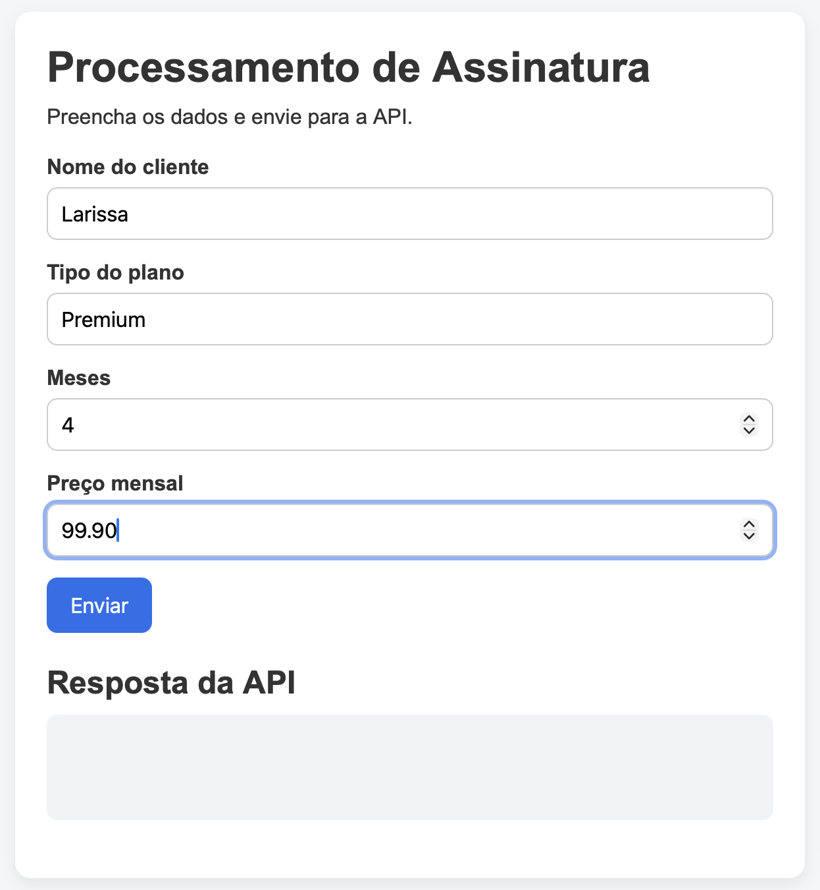
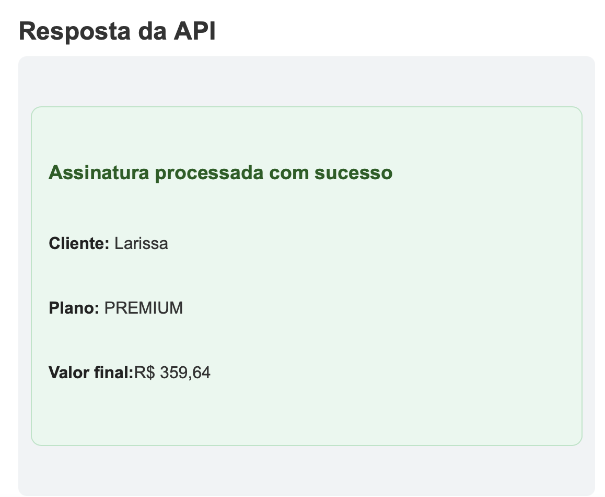

# 📦 Subscription System

Aplicação full stack para processamento de assinaturas.

---

## 🚀 Visão geral

Este projeto consiste em uma API REST desenvolvida com Spring Boot e um frontend em JavaScript puro que consome essa API.

O sistema permite processar assinaturas com validação de dados e cálculo de valor final com base no plano escolhido.

---

## 🛠 Tecnologias

### Backend
- Java
- Spring Boot
- API REST

### Frontend
- HTML
- CSS
- JavaScript (Vanilla)
- Fetch API

---

## ⚙️ Funcionalidades

- Processamento de assinatura
- Validação de campos obrigatórios
- Tratamento de erros (400 / 500)
- Cálculo de valor final
- Feedback visual de sucesso e erro
- Integração frontend ↔ backend

---

## 🔗 Endpoint

```http
POST /subscriptions/process
```

🌐 Frontend
O frontend está localizado na pasta:
/frontend

Ele consome a API e exibe:  

✅ Sucesso (card verde)
❌ Erro (card vermelho)
💬 Mensagens amigáveis para o usuário

📸 Interface
- Form

- Sucesso


## ▶️ Como rodar o projeto

### Backend

```bash
./mvnw spring-boot:run
```

Rodará em:
http://localhost:8080

### Frontend 

Abra o arquivo:  
frontend/index.html  

Ou utilize uma extensão como Live Server.

💡 Destaques técnicos
- Tratamento de CORS no backend
- Uso de async/await no frontend
- Parsing de respostas JSON
- Separação de responsabilidades (Controller / Service)
- Feedback visual orientado à experiência do usuário

📌 Status
Projeto concluído como exercício prático de integração frontend + backend.


